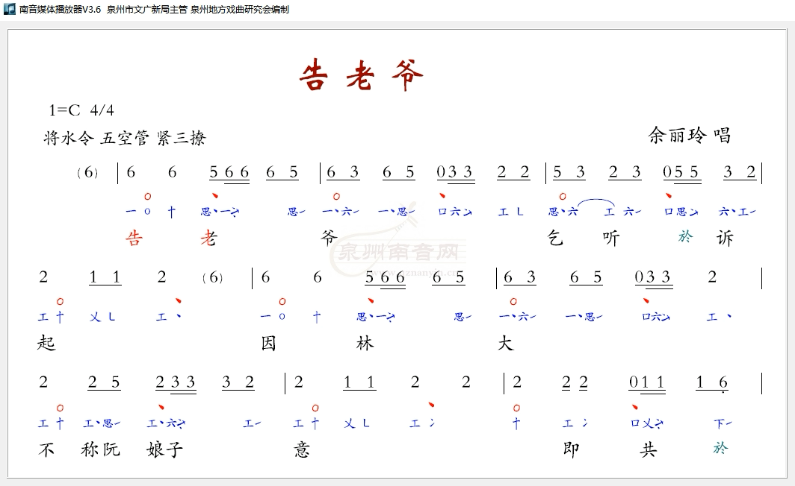

# 泉州南音网参考样例

来源页：[泉州南音网 - 工ㄨ谱简谱对照](http://www.qznanyin.cn/stave.html)

用途：这些样例作为比赛后续扩展的“真实资料来源”，用于人工截图、对比分栏、谱字、简谱和播放节奏。截图、说明和来源表保存在工程内，便于 Git 管理；完整外站视频只记录来源链接，避免仓库过大和版权风险。

本地资料目录：`docs/assets/qznanyin/`

## 10 个对照样例

| 序号 | 曲目 | 演唱者 | 页面 | 视频 | 对照用途 |
| ---: | --- | --- | --- | --- | --- |
| 1 | 玉箫声 | 苏诗咏 | [yxsssy.html](http://www.qznanyin.cn/yxsssy.html) | [yxsssy.mp4](http://www.qznanyin.cn/nanyind/sequelsongs/yxsssy/yxsssy.mp4) | 竖排工ㄨ谱和简谱对照的基础样例 |
| 2 | 告老爷 | 余丽玲 | [glyyll2.html](http://www.qznanyin.cn/glyyll2.html) | [glyyll2.mp4](http://www.qznanyin.cn/nanyind/sequelsongs/glyyll2/glyyll2.mp4) | 较短视频，适合快速截图做流程验证 |
| 3 | 莲步轻移 | 陈奎珍 | [lbqyckz.html](http://www.qznanyin.cn/lbqyckz.html) | [lbqyckz.mp4](http://www.qznanyin.cn/nanyind/sequelsongs/lbqyckz/lbqyckz.mp4) | 可观察工尺字与演唱节奏的对应 |
| 4 | 泥金书 | 周成在 | [njszcz.html](http://www.qznanyin.cn/njszcz.html) | [njszcz.mp4](http://www.qznanyin.cn/nanyind/sequelsongs/njszcz/njszcz.mp4) | 不同唱者、不同曲名的泛化样例 |
| 5 | 更深寂静 | 陈振梅 | [gsjjczm.html](http://www.qznanyin.cn/gsjjczm.html) | [gsjjczm.mp4](http://www.qznanyin.cn/nanyind/sequelsongs/gsjjczm/gsjjczm.mp4) | 曲名和《静夜思》意象接近，便于对比讲解 |
| 6 | 月半纱窗 | 杨双英 | [ybscysy.html](http://www.qznanyin.cn/ybscysy.html) | [ybscysy.mp4](http://www.qznanyin.cn/nanyind/sequelsongs/ybscysy/ybscysy.mp4) | 可观察长句中的连续谱字识别 |
| 7 | 小妹听说（北叠） | 周碧月 | [xmtzby.html](http://www.qznanyin.cn/xmtzby.html) | [xmtzby.mp4](http://www.qznanyin.cn/nanyind/sequelsongs/xmtzby/xmtzby.mp4) | 标题含曲体信息，适合说明资料标注 |
| 8 | 愁人怨 | 郑芳卉 | [cryzfh.html](http://www.qznanyin.cn/cryzfh.html) | [cryzfh.mp4](http://www.qznanyin.cn/nanyind/sequelsongs/cryzfh/cryzfh.mp4) | 用于检查不同谱面密度下的分栏 |
| 9 | 秀才先行 | 庄丽芬 | [xcxxzlf1.html](http://www.qznanyin.cn/xcxxzlf1.html) | [xcxxzlf1.mp4](http://www.qznanyin.cn/nanyind/sequelsongs/xcxxzlf1/xcxxzlf1.mp4) | 用于扩展测试表中的真实样例 |
| 10 | 劝哥哥 | 陈丽娟 | [qggclj.html](http://www.qznanyin.cn/qggclj.html) | [qggclj.mp4](http://www.qznanyin.cn/nanyind/sequelsongs/qggclj/qggclj.mp4) | 第 10 个对照样本，覆盖另一位演唱者 |

## 截图对比方法

1. 打开曲目页面，确认视频中出现工ㄨ谱、简谱或五线谱对照画面。
2. 截取含谱面的静态帧。
3. 用 App 的“流程”页观察：原图、黑白化、竖排分栏、单字打分。
4. 用 App 的“材料”页引用本表，说明后续会从这些真实曲目扩展测试集。

本地复现示例：

```sh
mkdir -p /private/tmp/qznanyin-samples/videos /private/tmp/qznanyin-samples/frames
curl -L -o /private/tmp/qznanyin-samples/videos/glyyll2.mp4 http://www.qznanyin.cn/nanyind/sequelsongs/glyyll2/glyyll2.mp4
qlmanage -t -s 1200 -o /private/tmp/qznanyin-samples/frames /private/tmp/qznanyin-samples/videos/glyyll2.mp4
```

## 已入库截图

### 告老爷

来源：[告老爷 - 泉州南音网](http://www.qznanyin.cn/glyyll2.html)

用途：横向工尺谱与简谱对照样例，可用于解释“横向对照谱从左到右、按小节读取；蓝色工尺谱翻译结果与上方黑色简谱校验”。



说明：截图只作为比赛学习与人工校验材料，保留来源链接和出处。
